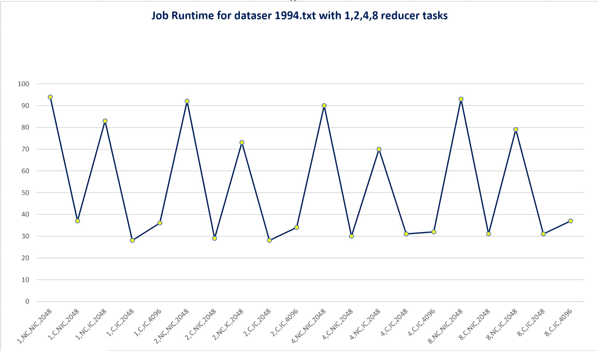
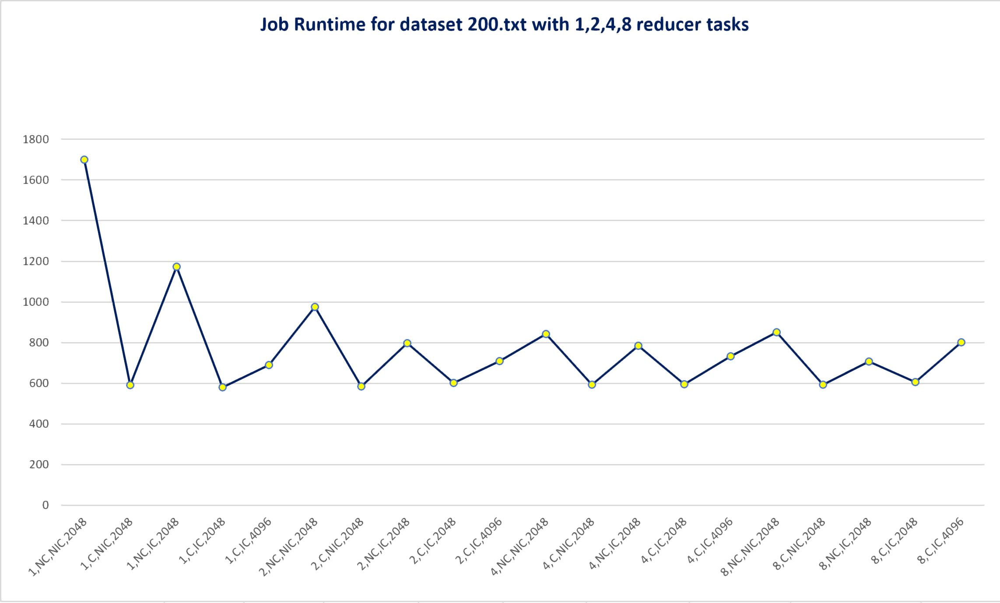
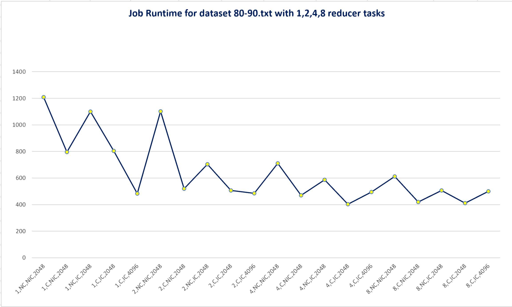
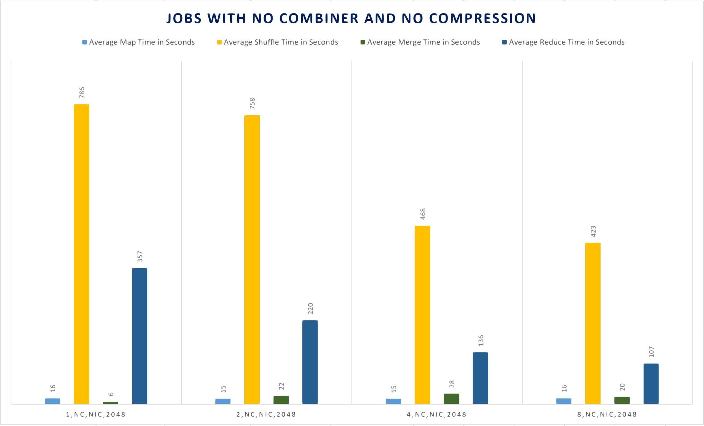
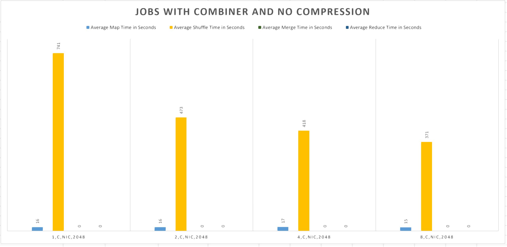
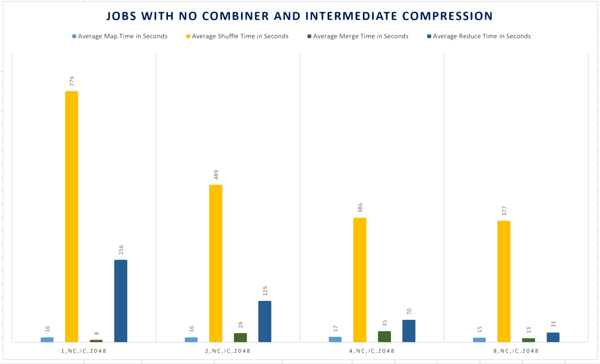
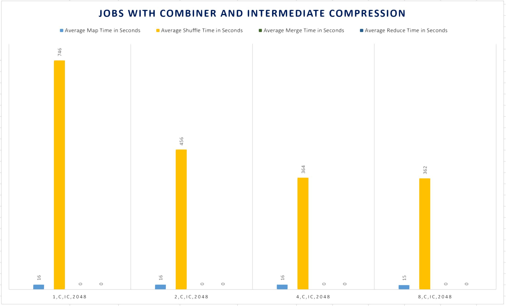
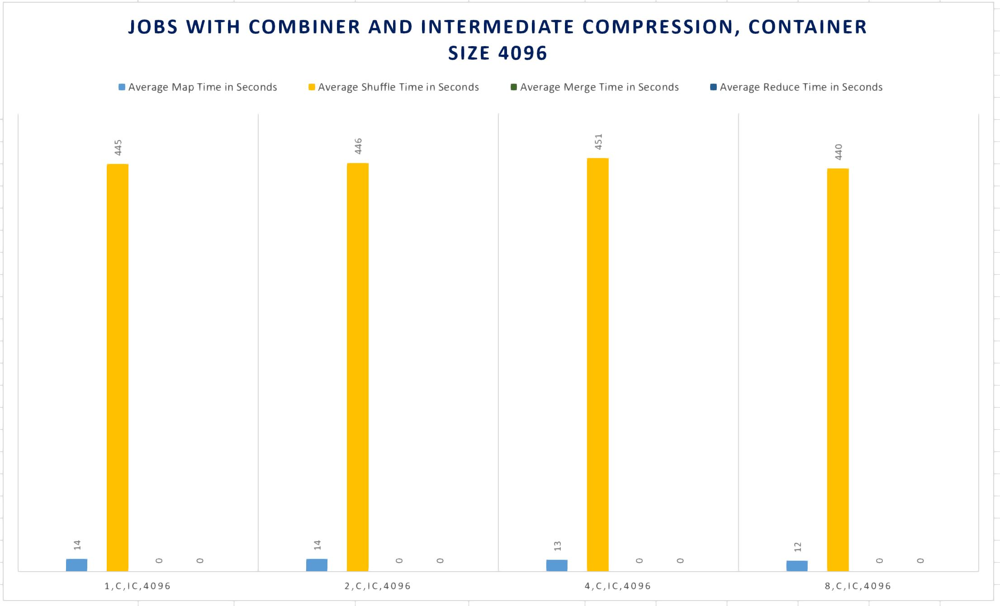

# Ashok Ramasami ITMD-521 Final Project

## Part -I Details inferred from Matrix of MapReduce Jobs

### MapReduce job with no Combiner and No Intermediate Compression

 Refer MaxTemperature.java in Matrix Jobs folder  
In this job all we do is read the data from the input text file and in the Mapper phase we map the year with the corresponding temperature value. The Mapper processes the data in small chunk.The output from Mapper phase is sent to the Reducer phase of the job. The reducer phase has three important stages namely Shuffle , Sort and Reduce. 
In the Sort stage values from different mappers but having same keys are grouped together and are fed to the Reducer in Shuffle stage. Shuffle and Sort occur concurrently. Now this key values are fed into the Reduce class where the values of a particular key is iterated and then the maximum of all the values is assigned to its corresponding key. In our case the Key is year while the values are temperatures recorded from different stations on days around the year. Running the job in this combination takes the most time than the other jobs although the average shuffle time decreases with increase in number of reduce tasks.

### MapReduce job with Combiner and No Intermediate Compression

 Refer MaxTemperatureWithCombiner.java in Matrix Jobs folder  
This job is similar to the above one instead we use a combiner class inbetween the mapper and reducer. Combiner is nothing other than a local reducer which combines the the map output records with same key. 
In overall using combiner reduces the time taken for data transfer inbetween the mapper and reducer , decrease the work that has to be done by the reducer. This can be seen while running the job on dataset which is relativly larger . When we run the job on the 200.txt or in 80-90.txt we can see thre is a significant drop in the runtime.While running the job on 1994.txt dataset the runtime is nearly half the runtime of the one without combiner.Inclusing a combiner in job reduces the average merging and reduce time to 0 .

### MapReduce job with Intermediate Compression and No Combiner

 Refer MaxTemperatureWithMapOutputCompression.java in Matrix Jobs folder  
It is seen when Intermediate Compression of Map output is done the time taken is less than the job without Intermediate compression but is greater than running Mapreduce with Combiner. Performing Intermediate compression decreases the average reduce time because the map output is compressed and the reducer has to comparatively access the output file which is necessarily small in size than the regular map output. Also the average reduce time decreases with increase in number of reduce tasks. 

### MapReduce job with Combiner and Intermediate Compression

 Refer MaxTemperatureWithCombinerMapOutputCompression.java in Matrix Jobs folder  
This is the combination of the MapReduce job with both combiner and Intermediate Compression of Map output. So technically it has the combined advantages of the combiner and compression which means the runtime of this kind should be the least of all.Average shuffling time decreases with increase in the number of reduce tasks while average merge and reduce time is 0 because of using combiner.

### MapReduce job with Combiner, Intermediate Compression and container size 4096

 Refer MaxTemperatureWithCombinerMapCompression.java in Matrix Jobs folder  
This is the same as the previos job except the  memory allocated for map and reduce containers is 4096 (4GB) while the JVM heap size for map and reduce is set to 80 percent of the physical memory. This 80 percent allocation is because if the heap memory is set to 100 percent  it may cause over usage of virtual memory and result in killing container. By doing so we allocate more memory for the YARN containers to read and write the data inside the filesystem. A container is where the MapReduce task runs a job has one or multiple containers. Allocating more memory for the container gives additional space for the map and reduce tasks which increases the efficiency. In this case the average merge and reduce time is zero as we have used combiner.

## Comparision of runtime of jobs with different number of redcue tasks
### Overall Runtime of Matrix jobs on 1994.txt

1. Job with no combiner and no compression has the maximum runtime on irrespective of the number of reduce tasks we set. 
2. No matter how many reduce tasks we use the jobs with combination of combiner and intermediate compression takes the minimum time to complete. 
3. Increasing the container size to 4096 has a effect on runtime but it is not as quick as the similar job with container size 2048.

### Overall Runtime of Matrix jobs on 200.txt

1. The overall runtime of job using combiner alone is similar in with different number of reduce tasks. 
2.Job combination combiner,aombiner with compression has almost similar overall runtime even when different number of reduce task is used. 
3.Time difference for jobs with compression and one without compression are nearly 200 secs when big datasets are used for reduce tasks 1 and 2 while for reduce tasks 4 ,8 there is not much of a difference 
4.Increasing the container size to 4096 along with increasing reduce task doesn't account for much time difference because of using combiner and compressions. 

### Overall Runtime of Matrix jobs on 80-90.txt

1.The time pattern for the dataset 80-90.txt should be similar to that of 200. Instead there are various spikes in the run time. This is a result of running jobs parallel in the cluster  
2.When jobs are run parallel in the cluster the memory allocation in other words the number of containers allocated for the Mapping and Reduce tasks are done dynamically which has direct effect on runtime.

## Comparing the average time for map , shuffle , merge and reduce for the dataset 80-90.txt
### Combination 1 (No combiner and No Intermediate compression)

Average Map, Merge time remains similar while the average time taken for shuffle, reduce operation decreases with increase in number of reduce tasks.

### Combination 2 ( combiner and No Intermediate compression)

Average Map time remains similar while the average time taken for merge,reduce operation is zero no matter how many reduce tasks we use. Average shuffle time decrease with increase in reduce tasks. 

### Combination 3 (Intermediate compression and No combiner )

Average Map time remains similar while the average time taken for shuffle,reduce operation seems to be much less than the job without intermediate combination and decreases with increase of reduce tasks.

### Combination 4 (Intermediate compression and combiner )

Average Map time remains similar while the average time taken for shuffle decreases with increase of reduce tasks.while the average time taken for merge,reduce operation is zero no matter how many reduce tasks we use.

### Combination 5 (Intermediate compression and combiner  with container size 4096 )

Average Map, shuffle time remains similar no matter how many reduce tasks we use. while the average time taken for merge,reduce operation is zero 

## Conclusion of Matrix jobs

1.Using combiner had a direct impact on the average merge and reduce time as local reduction of map output is done before sending it to the reducer. 
2.Usage of Intermediate compression impacts the average reduce time taken by MapReduce. 
3.Usage of more number of reduce tasks impacts the average reduce time when the job is ran with no combiner or  with combiner or with combiner and intermediate compression. 
4.Modifying the container size to 4096 means the application master requests memory allocation in multiples of 4 GB to the Resource manager. So if only less memory is availabe then the number of containers that could be run in parallel is less. 
5.Running jobs with container size 4096 had almost similar average shuffle time

## Part -II Chain Mapper
### Compute the maximum daily temperature for every station-date pair

Refer Chain-Mapping-Part1 folder for driver  for class files.  

For computing the Maximum daily temperature for every Station-Date pair in the mapper class we read the input 60-70.txt file and map the temperature value to the key which is a composit key. Here the station-date pair for each record is taken as the key and the corresponding temperature of the record is the value.  
In the reducer class we iterate through the mutliple values with same key and then assign the maximum value to the key and write it to the output path.

### Compute the mean of the maximum daily temperatures for every single station-day-month key

The ChainMapper class allows to use multiple Mapper classes within a single Map task. While the ChainReducer class allows to chain multiple Mapper clases after a reducer within the Reducer Task.  

The steps to be followed for computing the maximum daily temperatures for every single station-day-month key are 
Step 1 - Read the input data file 60-70.txt and then map the temperature value of each record with its corresponding Station-Date. In other words with the Station-Date as the composite key map the temperature as the value for that key for each record. 
Step 2 - Find the Maximum temperature value for every Station-Date key . Now assign the Maximum value alone to the Station-Date key so each key is mapped with only one value. 
Step 3 - Modify the Key value so as to remove the year component from the key which makes the key as a combination of Station-Day-Month  and map the corresponding values so each key has multiple values. 
Step 4 - Now iterate through the values of each key find the average and assign the average value to the corresponding Station-Day-Month key.  

The above steps can be executed in two ways one is by chaining jobs which means performing Map then Reduce and give the output of the Reduce again to Map and then Reduce. The other way is by the use of ChainMapper and ChainReducer. 

**Run the above job again with a combiner or w/o a combiner, does the result change?  Why or why not?**

Refer folder Chain-Mapping-Part2.2 for class files.  
Running the jobs without combiner and with combiner has major impact on the runtime of the job as using the combiner decreases the average reduce time to 0. The results doesnt change when using combiner

**Other solution for Question 2**

Refer folder Chain-Mapping-Part2.1 for class files.  
In this type of solution the Mapper class Maps the station-date value to the temperature for each record, then it is sent to the combiner where the temperature value of each record is iterated to find the max value corresponding to the station-date key, and the value is assigned to a modified key before sending it to the reducer. Here the ChainReducer class is used so as the output from combiner is fed to Reducer and then the reducer iterates the value with same key and then assigns the key with the average value. Next there is a mapper which modifies the key into Station-Day-Month pair and assign the average value.  
In this case if no combiner is used in between the mapper and reducer then the output will be the mean of daily temperature of every single Station-Day-Month key. 

**Solution for chaining two jobs in single driver file**

Refer folder Part 2 Q2 for class files. 
Has two mapreduce jobs in a single driver file where the output of job 1 is taken as input for the job 2 

