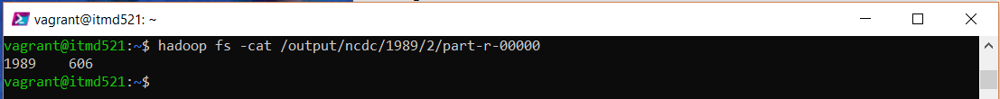
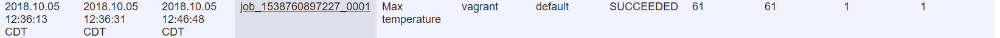
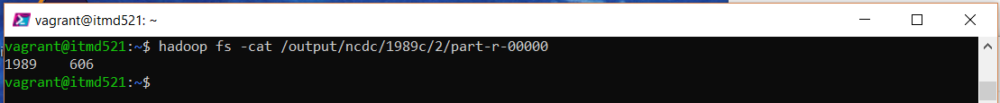
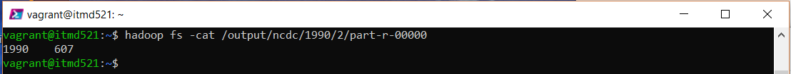
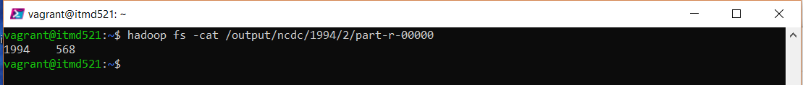

# Ashok Ramasami ITMD-521 Week-05 MapReduce Jobs

# Dataset of year 1989
## Max Temperature for 1989

## Job details
### Time taken for finishing the job 10 min 17 sec

## Max Temperature with Combiner for 1989

## Job details
### Time taken for finishing the job 4 min 40 sec

# Dataset of year 1990
## Max Temperature for 1990

## Job details
### Time taken for finishing the job 5 min 26 sec

## Max Temperature with Combiner for 1990

## Job details
### Time taken for finishing the job 5 min 3 sec

# Dataset of year 1994
## Max Temperature for 1994

## Job details
### Time taken for finishing the job 5 min 10 sec

## Max Temperature with Combiner for 1994

## Job details
### Time taken for finishing the job 4 min 58 sec

