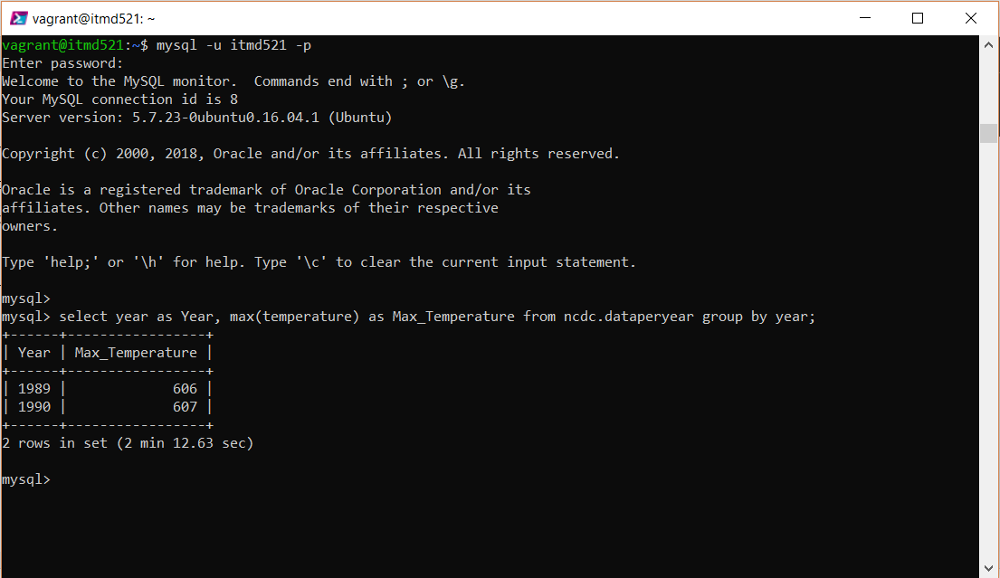
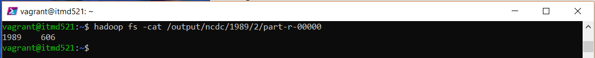
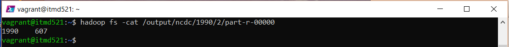

# Ashok Ramasami ITMD-521 Week-06 Hadoop and SQL Comparison

## SQl Query output for the years 1989 and 1990

## Hadoop output for MaxTemperature job for the year 1989

## Job Details
### Time taken for finishing the job 10 min 17 sec

## Hadoop output for MaxTemperature job for the year 1990

## Job Details
### Time taken for finishing the job 5 min 26 sec
