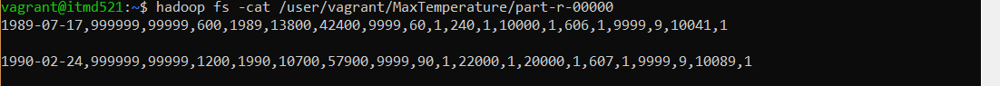
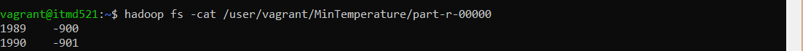
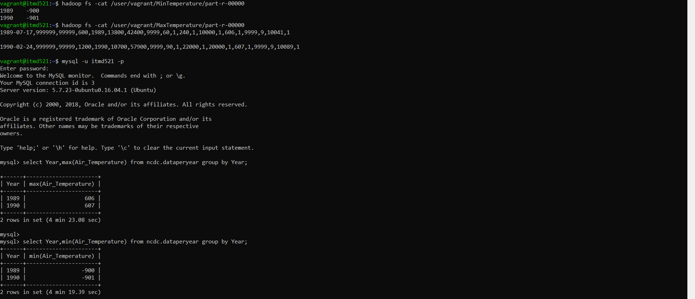

# Ashok Ramasami ITMD-521 Week-08 Sqoop Assignment

## MaxTemperature job output from Sqoop

 Refer MaxTemperaturePerYear.java

 Obtained MaxWidget.java file from Chapter 15 and made slight modifications so as to display the entire record with maximum temperature for the two years 1989 and 1990.
In MaxWidget.java the mapper writes all the values to the key 0, but here we modified the key into the year in which the record was taken and the rest as value for that key. This way now we have two keys and multiple values for those keys.
In the reducer we take the key, values from mapper and compare the temperature of each record with one another and write the entire record with the maximum temperature for the respective year as key output into the output hadoop filesystem
 

Steps to compile the java files for required output

1.Run the sqoop codegen job on the table ncdc.dataeryear to generate the Station.java file. 
2.Now compile the MaxTemperaturePerYear.java and Station.java into a jar file  
3.Run the jar file with class MaxTemperaturePerYear along with sqoop libraries 
4.No input and output path is required while running the jar file as both paths are provided in the MaxTemperaturePerYear.java file.

## MinTemperature job output from Sqoop

 Refer MinTemperaturePerYear.java

 Obtained MaxWidget.java file from Chapter 15 and made slight modifications so as to display the year(key) and Min Temperature(value) for the two years 1989 and 1990.
In MaxWidget.java the mapper writes all the values to the key 0, but here we modified the key into the year in which the record was taken and the rest as the value for that key. This way now we have two keys and multiple values for those keys.
In the reducer we take the key, values from mapper and compare the temperature of each record with one another and write the minimum temperature for the respective year as the value for the key obtained from the Mapper. Finally write the output into the hadoop filesystem 
 

Steps to compile the java files for required output

1.Run the sqoop codegen job on the table ncdc.dataeryear to generate the Station.java file. 
2.Now compile the MinTemperaturePerYear.java and Station.java into a jar file  
3.Run the jar file with class MinTemperaturePerYear along with sqoop libraries 
4.No input and output path is required while running the jar file as both paths are provided in the MinTemperaturePerYear.java file.

## SQL vs Sqoop output comparison

